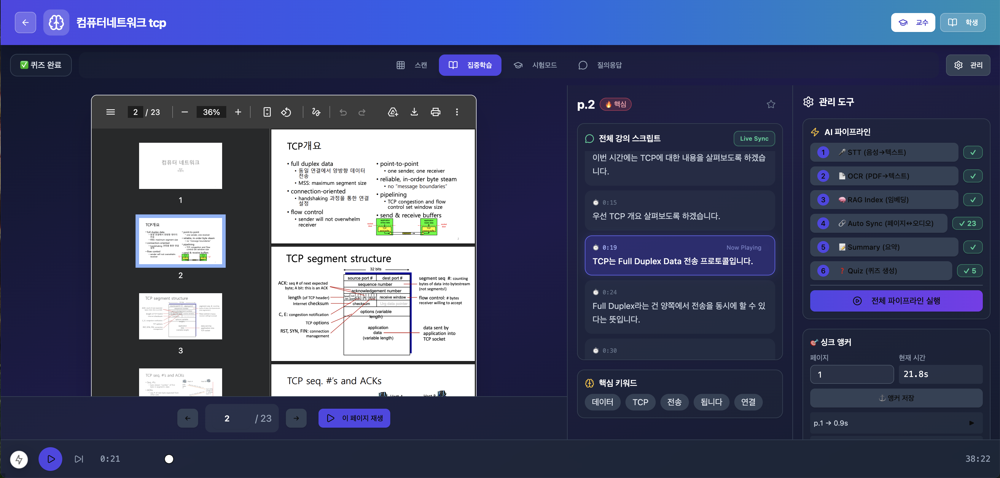
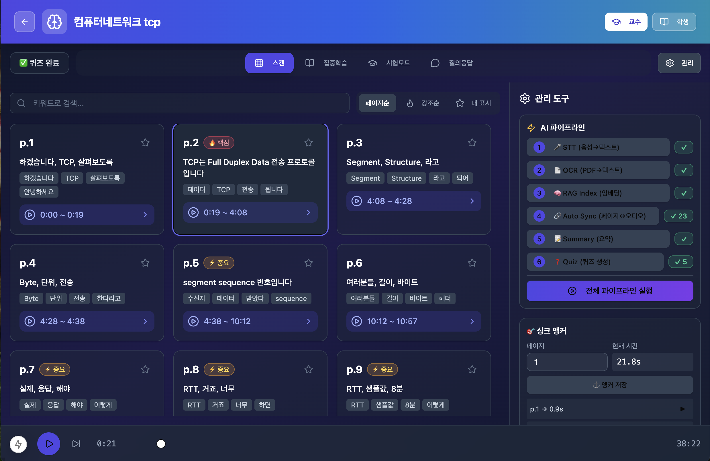

# AI Agent for Professors

교수용 강의 관리 AI 시스템 - PDF 강의자료와 오디오를 업로드하면 자동으로 STT, OCR, 페이지-오디오 싱크, 요약, 퀴즈를 생성합니다.

---

## 목차
- [주요 기능](#주요-기능)
- [시스템 아키텍처](#시스템-아키텍처)
- [기술 스택](#기술-스택)
- [프로젝트 구조](#프로젝트-구조)
- [설치 방법](#설치-방법)
- [실행 방법](#실행-방법)
- [API 엔드포인트](#api-엔드포인트)
- [데이터 저장 구조](#데이터-저장-구조)
- [성능 평가](#성능-평가)

---

## 스크린샷

### 집중학습 모드 — Auto Sync 결과



PDF 페이지와 음성 자막이 실시간으로 동기화됩니다. 우측 AI 파이프라인 패널에서 STT, OCR, RAG Index, Auto Sync 등 각 단계의 처리 상태를 확인할 수 있습니다.

### 스캔 모드 — 페이지별 키워드/구간 추출



각 페이지의 핵심 키워드와 매칭된 음성 구간(타임스탬프)을 카드 형태로 한눈에 볼 수 있습니다.

## 주요 기능

| 기능 | 설명 | 모델/기술 |
|------|------|----------|
| STT | 강의 오디오를 텍스트로 변환 | faster-whisper (large-v3) |
| OCR | PDF 슬라이드에서 텍스트 추출 | Qwen2.5-VL-7B |
| 형태소 분석 | 한국어 키워드 추출 (조사/어미 제거) | kiwipiepy |
| 임베딩 | 다국어 텍스트 벡터화 (한국어+영어) | BAAI/bge-m3 |
| Auto Sync | 페이지-오디오 자동 매칭 | 임베딩+키워드 결합 DP 알고리즘 |
| RAG Q&A | 강의 내용 기반 질의응답 | GPT-4.1-mini + 벡터 검색 |
| 요약 | 강의 내용 자동 요약 | GPT-4.1-mini |
| 퀴즈 | 객관식 문제 자동 생성 | GPT-4.1-mini |

> RAG Q&A와 Auto Sync는 서로 다른 기능입니다. RAG Q&A는 강의 내용에 대한 질의응답(검색+생성)에 사용되고, Auto Sync는 슬라이드와 음성의 시간 동기화(유사도 매칭+경로탐색)에 사용됩니다. 둘 다 임베딩을 사용하지만 목적과 구조가 다릅니다.

### 학습 모드 (학생용)

- **스캔 모드**: 전체 페이지를 카드로 탐색, 키워드/강조도 표시
- **집중학습 모드**: PDF + 실시간 자막 싱크
- **시험 모드**: 컨닝페이퍼 빌더, 예상문제 확인
- **질의응답 모드**: RAG 기반 Q&A

---

## 시스템 아키텍처

```
+-----------------+     +-----------------+     +-------------------------+
|   Frontend      |     |    Backend      |     |      GPU Server         |
|   (Next.js)     |---->|   (FastAPI)     |---->|   (RTX A6000 x2)        |
|   :3000         |     |   :8000         | SSH |                         |
+-----------------+     +-----------------+     |  +-------------------+  |
                                                |  | faster-whisper    |  |
                                                |  | (STT)             |  |
                                                |  +-------------------+  |
                                                |  +-------------------+  |
                                                |  | Qwen2.5-VL-7B     |  |
                                                |  | (OCR)             |  |
                                                |  +-------------------+  |
                                                |  +-------------------+  |
                                                |  | BGE-M3            |  |
                                                |  | (Embedding,       |  |
                                                |  |  다국어 지원)      |  |
                                                |  +-------------------+  |
                                                +-------------------------+
```

### 데이터 흐름

```
1. 업로드     : PDF + 오디오 -> 백엔드 저장
2. STT        : 오디오 -> GPU (faster-whisper) -> transcript.json
3. OCR        : PDF -> GPU (Qwen-VL) -> pages.json
4. RAG Index  : pages.json -> GPU (임베딩) -> index.json
5. Auto Sync  : pages + transcript -> GPU (임베딩) + 형태소 분석(kiwipiepy) -> anchors (DB)
6. Summary    : pages.json -> GPT-4 -> summary.txt
7. Quiz       : pages.json -> GPT-4 -> quiz.json
```

---

## 기술 스택

### Frontend
- Next.js 14 (App Router)
- TypeScript
- Tailwind CSS
- shadcn/ui (컴포넌트)
- react-pdf (PDF 뷰어)

### Backend
- FastAPI (Python)
- SQLModel (ORM)
- SQLite (DB)
- kiwipiepy (한국어 형태소 분석 - 키워드 추출)
- scikit-learn (TF-IDF 기반 키워드 매칭)

### GPU Server
- faster-whisper (STT) - large-v3 모델
- Qwen2.5-VL-7B-Instruct (OCR) - Vision-Language 모델
- FlagEmbedding (임베딩) - BAAI/bge-m3 (다국어 지원, 한국어+영어 혼합 강의에 최적화)

### External API
- OpenAI GPT-4.1-mini (요약, 퀴즈, RAG 답변)

> **임베딩 모델 변경 히스토리**: 기존 `jhgan/ko-sroberta-multitask`(한국어 특화)는 PDF(영어)와 음성 자막(한국어)이 혼재된 강의에서 유사도 계산이 부정확한 문제가 있어 `BAAI/bge-m3`(다국어)로 교체했습니다. 단, Auto Sync 알고리즘의 DP 로직은 아직 새 모델의 유사도 분포에 맞게 재조정이 필요합니다. 자세한 내용은 [성능 평가](#성능-평가) 참고.

---

## 프로젝트 구조

```
ai-agent-professors/
├── frontend/                    # Next.js 프론트엔드
│   ├── app/
│   │   ├── page.tsx            # 메인 페이지
│   │   └── lectures/[id]/
│   │       └── page.tsx        # 강의 상세 페이지
│   ├── components/
│   │   ├── TopNav.tsx
│   │   ├── PdfViewer.tsx
│   │   └── ui/                 # shadcn 컴포넌트
│   └── package.json
│
├── backend/                     # FastAPI 백엔드
│   ├── app/
│   │   ├── main.py             # API 엔드포인트
│   │   ├── models.py           # DB 모델
│   │   ├── db.py               # DB 설정
│   │   ├── storage.py          # 파일 저장
│   │   ├── whisper_runner.py   # STT 실행 (SSH)
│   │   ├── embedding_runner.py # 임베딩 실행 (SSH)
│   │   ├── ocr_runner.py       # OCR 실행 (SSH)
│   │   └── sync_algorithms/    # 동기화 알고리즘 모듈
│   │       ├── base.py         # TextProcessor (kiwipiepy 키워드 추출)
│   │       ├── exact_matching.py    # TF-IDF 키워드 매칭
│   │       ├── cosine_similarity.py # 임베딩 유사도 매칭
│   │       ├── hybrid.py            # 키워드+임베딩 결합
│   │       ├── structured_pdf.py    # 제목 가중치 매칭
│   │       ├── llm_semantic.py      # GPT 기반 의미 판단
│   │       ├── evaluation.py        # F1/ROC-AUC 평가
│   │       └── benchmark.py         # 알고리즘 벤치마크 실행
│   ├── debug_report.py         # 알고리즘별 실패 페이지 디버그 리포트
│   ├── app.db                  # SQLite DB (강의 메타데이터, anchors) - git 추적 제외
│   ├── lectures/{id}/          # 강의별 처리 결과 (transcript, pages, sync_result, index 등) - git 추적 제외
│   │   └── ground_truth.json   # 평가용 정답 데이터 - git 추적 유지 (실험 재현용)
│   ├── data/
│   │   ├── lectures/{id}/      # 업로드 원본 (audio.mp3, source.pdf) - git 추적 제외
│   │   │   └── ground_truth.json  # 정답 데이터 사본 - git 추적 유지
│   │   └── benchmark_results/  # 벤치마크/디버그 결과 - git 추적 유지
│   └── requirements.txt
│
└── GPU Server (별도 서버)
    ├── whisper-gpu/             # STT + 임베딩
    │   ├── venv/
    │   ├── whisper_server.py
    │   └── embedding_server.py  # BGE-M3 임베딩 서버
    │
    └── qwen-ocr/                # OCR
        ├── venv/
        └── ocr_script.py
```

> **경로 중복 주의**: 현재 강의 처리 결과물은 `backend/lectures/{id}/`에, 업로드 원본 및 일부 평가 데이터는 `backend/data/lectures/{id}/`에 나뉘어 저장되고 있습니다. 두 경로 모두 `ground_truth.json`이 존재하며 둘 다 git에 추적됩니다. 향후 하나의 경로로 통합하는 정리가 필요합니다.

---

## 설치 방법

### 1. 프론트엔드

```bash
cd frontend
npm install
```

### 2. 백엔드

```bash
cd backend
python -m venv .venv
.venv\Scripts\activate  # Windows
pip install -r requirements.txt
pip install kiwipiepy   # 한국어 형태소 분석
```

### 3. GPU 서버 - STT & 임베딩

```bash
# whisper-gpu 환경
cd ~/whisper-gpu
python3 -m venv venv
source venv/bin/activate

pip install torch torchvision --index-url https://download.pytorch.org/whl/cu121
pip install faster-whisper
pip install transformers==4.44.0       # FlagEmbedding 호환성 위해 버전 고정
pip install FlagEmbedding==1.2.5       # BGE-M3 임베딩
```

> **버전 호환성 주의**: `FlagEmbedding`은 `transformers` 최신 버전과 충돌할 수 있습니다. `FlagEmbedding==1.2.5` + `transformers==4.44.0` 조합으로 고정해서 사용하세요. 또한 `torch.load` 보안 정책으로 인해 torch는 최신 버전(2.6+)을 권장합니다.

### 4. GPU 서버 - OCR (Qwen-VL)

```bash
# qwen-ocr 환경 (별도 가상환경)
cd ~/qwen-ocr
python3 -m venv venv
source venv/bin/activate

pip install torch torchvision --index-url https://download.pytorch.org/whl/cu121
pip install transformers>=4.45.0 accelerate qwen-vl-utils
pip install pillow pdf2image

# poppler 설치 (PDF 변환용)
sudo apt install poppler-utils
```

### 5. 환경 변수

```bash
# 백엔드 (.env 또는 환경변수)
export OPENAI_API_KEY="sk-..."
```

---

## 실행 방법

### 1. 백엔드 실행

```bash
cd backend
.venv\Scripts\activate
uvicorn app.main:app --reload --host 0.0.0.0 --port 8000
```

### 2. 프론트엔드 실행

```bash
cd frontend
npm run dev
```

### 3. 접속

- 프론트엔드: http://localhost:3000
- 백엔드 API: http://localhost:8000
- API 문서: http://localhost:8000/docs

### 4. 알고리즘 벤치마크/디버깅 (프론트엔드 불필요)

벤치마크와 디버그 리포트는 백엔드 + GPU 서버만으로 실행 가능합니다.

```bash
cd backend
source .venv/bin/activate
export $(cat ../.env | xargs)

# 전체 알고리즘 벤치마크
python -m app.sync_algorithms.benchmark \
  --lectures 1,2,3 \
  --base-dir ./data \
  --grouping duration \
  --group-duration 30 \
  --confidence-threshold 0.05 \
  --algorithms exact_matching,cosine_similarity,hybrid,structured_pdf

# 알고리즘별 실패 원인 디버그 리포트
python debug_report.py 1,2,3 30 exact_matching
```

---

## API 엔드포인트

### 강의 관리

| Method | Endpoint | 설명 |
|--------|----------|------|
| POST | `/lectures` | 강의 생성 |
| GET | `/lectures` | 강의 목록 |
| GET | `/lectures/{id}` | 강의 상세 |
| DELETE | `/lectures/{id}` | 강의 삭제 |
| POST | `/lectures/{id}/upload` | PDF/오디오 업로드 |

### AI 파이프라인

| Method | Endpoint | 설명 | 결과 파일 |
|--------|----------|------|----------|
| POST | `/lectures/{id}/transcribe` | STT 실행 | transcript.json |
| POST | `/lectures/{id}/ocr_pdf` | OCR 실행 | pages.json |
| POST | `/lectures/{id}/rag_index` | 임베딩 인덱스 생성 | index.json |
| POST | `/lectures/{id}/auto_sync` | 페이지-오디오 자동 싱크 | anchors (DB) |
| POST | `/lectures/{id}/summary` | 요약 생성 | summary.txt |
| POST | `/lectures/{id}/quiz` | 퀴즈 생성 | quiz.json |

### 조회

| Method | Endpoint | 설명 |
|--------|----------|------|
| GET | `/lectures/{id}/transcript` | 자막 조회 |
| GET | `/lectures/{id}/anchors` | 앵커 조회 |
| GET | `/lectures/{id}/summary` | 요약 조회 |
| GET | `/lectures/{id}/quiz` | 퀴즈 조회 |
| GET | `/lectures/{id}/similarity_matrix` | 유사도 히트맵 |
| POST | `/lectures/{id}/rag_ask` | RAG 질의응답 |

---

## 데이터 저장 구조

실제 강의 처리 결과물은 `backend/lectures/{lecture_id}/`에 저장됩니다 (업로드 원본 및 정답 데이터 일부는 `backend/data/lectures/{lecture_id}/`에 별도 저장).

```
backend/lectures/{lecture_id}/
├── ground_truth.json        # 평가용 정답 (페이지->시각) - git 추적
├── pages.json                # OCR 결과 (페이지별 텍스트) - git 추적 제외
├── transcript.json           # STT 결과 (자막) - git 추적 제외
├── index.json                 # RAG 임베딩 인덱스 - git 추적 제외
├── sync_debug.json            # Auto Sync 디버그 정보 - git 추적 제외
├── similarity_matrix*.json    # 알고리즘별 페이지-자막 유사도 행렬 - git 추적 제외
├── sync_result_*.json         # 알고리즘별 동기화 결과 - git 추적 제외
├── summary.txt                # GPT 생성 요약 - git 추적 제외
├── quiz.json                  # GPT 생성 퀴즈 - git 추적 제외
└── chat.json                  # 채팅 기록 - git 추적 제외

backend/data/lectures/{lecture_id}/
├── source.pdf                 # 업로드된 PDF - git 추적 제외
├── audio.mp3                  # 업로드된 오디오 - git 추적 제외
└── ground_truth.json          # 정답 데이터 사본 - git 추적

backend/data/benchmark_results/
├── benchmark_YYYYMMDD_HHMMSS.json        # 알고리즘별 벤치마크 결과 - git 추적
├── benchmark_report_YYYYMMDD_HHMMSS.md   # 벤치마크 리포트 - git 추적
├── autosync_eval_YYYYMMDD_HHMMSS.json    # auto_sync 알고리즘 평가 결과 - git 추적
└── debug_report_lecture{id}_{algo}.txt   # 알고리즘별 실패 페이지 디버그 - git 추적
```

### 파일 포맷 예시

#### transcript.json
```json
{
  "segments": [
    {"start": 0.0, "end": 3.5, "text": "안녕하세요, 오늘 강의를 시작하겠습니다."},
    {"start": 3.5, "end": 7.2, "text": "오늘은 TCP 프로토콜에 대해 알아보겠습니다."}
  ]
}
```

#### pages.json
```json
{
  "lecture_id": 7,
  "num_pages": 10,
  "pages": [
    {"page": 1, "text": "TCP/IP 프로토콜 개요..."},
    {"page": 2, "text": "3-way handshake..."}
  ]
}
```

---

## SSH 설정

GPU 서버와 백엔드 간 SSH 키 인증 설정이 필요합니다:

```bash
# Windows 백엔드에서
ssh-keygen -t rsa -b 4096
ssh-copy-id user@gpu-server

# ~/.ssh/config 설정
Host test223
    HostName gpu-server-ip
    User sypark
    IdentityFile ~/.ssh/id_rsa
```

> **참고**: 연구실 외부망에서는 GPU 서버 SSH 포트가 방화벽으로 막혀 접속이 안 될 수 있습니다. 연구실 내부망(`test223`)에서만 안정적으로 접속 가능하며, 외부에서 접속이 필요한 경우 관리자에게 방화벽 설정 확인을 요청해야 합니다.

---

## 성능 참고 (파이프라인 처리 시간)

| 작업 | 소요 시간 (예상) |
|------|-----------------|
| STT (30분 오디오) | ~3-5분 |
| OCR (10페이지 PDF) | ~2-3분 |
| RAG Index (30청크) | ~10초 |
| Auto Sync | 약 15초 ~ 1분 (강의 길이에 따라) |
| Summary | ~5초 |
| Quiz | ~5초 |

---

## 성능 평가

Auto Sync 알고리즘은 슬라이드-음성 동기화를 위해 여러 매칭 전략을 실험·비교했습니다.

### 평가 방법

- **데이터셋**: 컴퓨터 네트워크 강의 영상 3개 (23~43페이지, 평균 40분)
- **정답(Ground Truth)**: 슬라이드별 실제 시작 시각 수동 레이블링
- **평가 지표**: F1 Score (예측 시각과 정답 시각의 차이가 tolerance 이내면 정답)
- **Tolerance 기준**: ±30초 (방송 자막 기준 ±10초보다 관대하게 설정 - 강의 특성상 합리적 수준)

### 비교한 알고리즘

| 알고리즘 | 방식 |
|---|---|
| Exact Matching | TF-IDF 기반 키워드 매칭 |
| Cosine Similarity | 임베딩 벡터 코사인 유사도 |
| Hybrid | 키워드 + 임베딩 결합 |
| Structured PDF | 슬라이드 제목 가중치 임베딩 |
| LLM Semantic | GPT-4o-mini 의미 판단 |
| Auto Sync (제안 방법) | 임베딩 + kiwipiepy 키워드 + DP 경로탐색 + 선형보간 + 슬라이딩윈도우 |

### 핵심 개선 사항

1. **kiwipiepy 형태소 분석 도입**: 한국어 조사/어미를 제거해 키워드 추출 품질 향상
2. **TF-IDF 적용**: 흔한 단어보다 페이지 특정적인 희귀 단어에 높은 가중치
3. **임베딩 모델 교체 (ko-sroberta -> BGE-M3)**: PDF(영어)와 음성 자막(한국어)이 혼재된 환경에서 다국어 모델 적용 시 baseline 알고리즘들의 성능이 대폭 향상

### F1 Score 비교 (tolerance ±30초, 3개 강의 평균)

| 알고리즘 | ko-sroberta (교체 전) | BGE-M3 (교체 후) |
|---|---|---|
| Structured PDF | 0.422 | **0.585** |
| Cosine Similarity | 0.343 | **0.549** |
| Hybrid | 0.395 | **0.500** |
| Exact Matching | 0.436 | 0.436 (임베딩 미사용, 변화 없음) |
| **Auto Sync (제안 방법)** | **0.468** | 0.378 |

> 임베딩 기반 baseline(Structured PDF, Cosine Similarity, Hybrid)은 BGE-M3 교체로 평균 F1이 +10~21%p 향상되었습니다. 다만 제안 방법인 Auto Sync는 오히려 성능이 하락(0.468 -> 0.378)했습니다.
>
> 원인 분석 결과, Auto Sync의 DP 경로 탐색 로직이 BGE-M3의 유사도 점수 분포(키워드 가산점 포함 시 약 0.2~2.3 범위, ko-sroberta보다 넓고 분산됨)에 맞게 조정되지 않아 동일 세그먼트에 여러 페이지가 중복 매칭되는 문제가 발생했습니다. 예를 들어 "TCP 타이머"처럼 강의 전반에 반복 언급되는 키워드가 있는 경우, 서로 다른 페이지들이 같은 음성 구간으로 잘못 수렴했습니다. 현재 threshold 재조정 및 중복 매칭 방지 로직 추가 작업이 진행 중입니다.

### 실패 원인 분석 (3가지 공통 패턴)

| 패턴 | 설명 |
|---|---|
| 언어 불일치 | PDF(영어 수식/용어) - 음성 자막(한국어 설명) 간 표현 차이로 키워드 매칭 실패 |
| 인접 구간 혼동 | 강의 특성상 비슷한 내용이 연속으로 이어져 정답/예측 구간의 키워드가 거의 동일 |
| DP 도미노 현상 | 임베딩 기반 알고리즘에서 한 페이지가 잘못 매칭되면 이후 페이지가 연쇄적으로 밀림 |

### 벤치마크/디버깅 실행

```bash
# 전체 알고리즘 벤치마크
python -m app.sync_algorithms.benchmark \
  --lectures 1,2,3 \
  --algorithms exact_matching,cosine_similarity,hybrid,structured_pdf

# 알고리즘별 페이지 실패 원인 분석
python debug_report.py 1,2,3 30 exact_matching
python debug_report.py 1,2,3 30 cosine_similarity
```

---

## 라이선스

MIT License

---

## 크레딧

- [faster-whisper](https://github.com/guillaumekln/faster-whisper) - STT
- [Qwen2.5-VL](https://github.com/QwenLM/Qwen2.5-VL) - OCR
- [BGE-M3](https://github.com/FlagOpen/FlagEmbedding) - 다국어 임베딩
- [kiwipiepy](https://github.com/bab2min/kiwipiepy) - 한국어 형태소 분석
- [OpenAI](https://openai.com/) - GPT API
